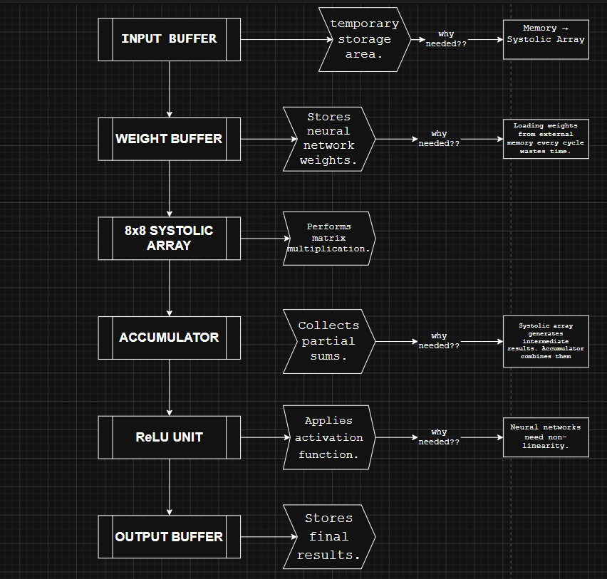
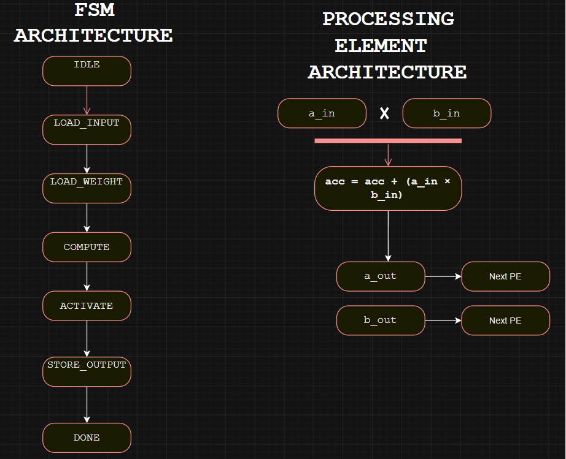
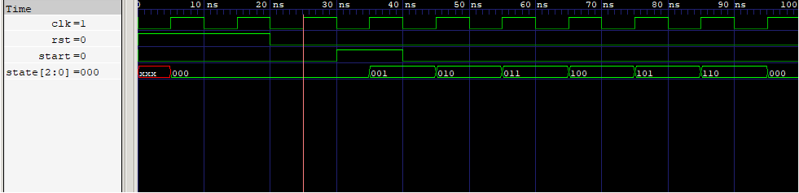
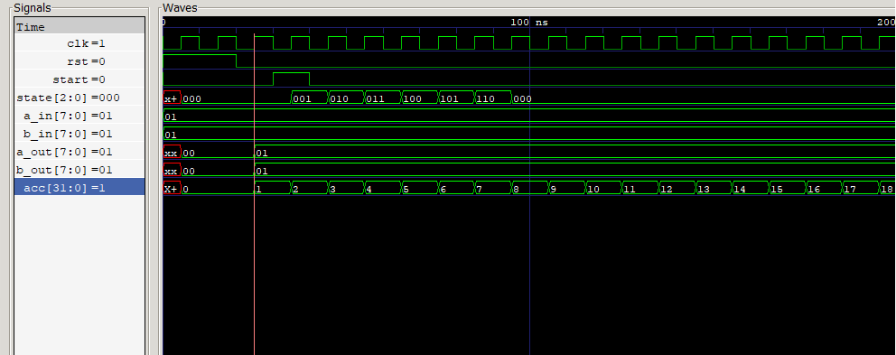
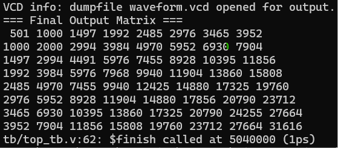

# 🚀 FPGA Neural Accelerator

An 8×8 systolic-array-based neural network accelerator implemented in Verilog HDL with ReLU activation and waveform verification using Icarus Verilog and GTKWave.

---

## 📌 Features

- 8×8 Systolic Array Architecture
- Processing Elements (PE)
- Controller FSM
- Input Buffer
- Weight Buffer
- ReLU Activation Unit
- Output Buffer
- Parameterized Verilog Modules
- GTKWave Verification
- Icarus Verilog Simulation

---

## 🏗️ System Architecture

<p align="center">
  
</p>

---

## ⚙️ Processing Element Architecture

<p align="center">
  
</p>

---

## 📂 RTL Modules

```
rtl/
├── accumulator.v
├── controller_fsm.v
├── input_buffer.v
├── weight_buffer.v
├── pe.v
├── systolic_array.v
├── relu.v
├── output_buffer.v
└── neural_accelerator_top.v
```

---

## 🔄 FSM Waveform

<p align="center">
  
</p>

---

## 🔧 Processing Element Waveform

<p align="center">
  
</p>

---

## 📊 Simulation Result

<p align="center">
  
</p>

---

## 🛠 Tools Used

- Verilog HDL
- Icarus Verilog
- GTKWave
- VS Code
- Git
- GitHub

---

## 🚀 Future Improvements

- Parameterized N×N systolic array
- Fixed-point arithmetic support
- BRAM-based memory architecture
- AXI interface
- Vivado synthesis and implementation
- FPGA deployment
- CNN acceleration
- TinyML inference engine

---

## 📁 Project Structure

```
fpga-neural-accelerator
│
├── diagrams
├── docs
├── results
│   └── screenshots
├── rtl
├── tb
├── README.md
└── .gitignore
```

---
