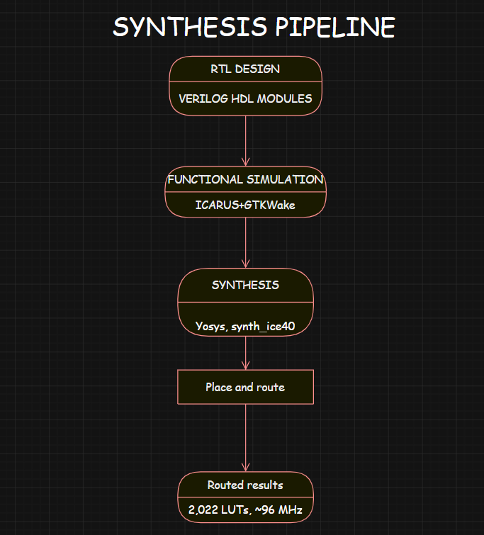

# 🚀 FPGA Neural Accelerator

An 8×8 systolic-array-based neural network accelerator implemented in Verilog HDL with ReLU activation and waveform verification using Icarus Verilog and GTKWave.

---

## 📌 Features

- 8×8 Systolic Array Architecture
- Processing Elements (PE)
- Controller FSM
- Input Buffer
- Weight Buffer
- ReLU Activation Unit
- Output Buffer
- Parameterized Verilog Modules
- GTKWave Verification
- Icarus Verilog Simulation

---

## 🏗️ System Architecture

<p align="center">
  
</p>

---

## ⚙️ Processing Element Architecture

<p align="center">
  
</p>

---

## 📂 RTL Modules

```
rtl/
├── accumulator.v
├── controller_fsm.v
├── input_buffer.v
├── weight_buffer.v
├── pe.v
├── systolic_array.v
├── relu.v
├── output_buffer.v
└── neural_accelerator_top.v
```

---

## 🔄 FSM Waveform

<p align="center">
  
</p>

---

## 🔧 Processing Element Waveform

<p align="center">
  
</p>

---

## 📊 Simulation Result

<p align="center">
  
</p>

---
## 🔧 Synthesis Results



This design was synthesized for an iCE40 FPGA using the open-source Yosys + nextpnr toolchain. Module ports were refactored from unpacked array ports to flattened buses to make the design synthesizable — the original simulation-only RTL used array-typed ports, which don't map to physical I/O on real hardware.

| Metric | Value |
|---|---|
| Target device | iCE40 HX8K |
| LUTs | 2,022 / 7,680 (54%) |
| Flip-flops | ~4,075 |
| Carry cells | 1,871 |
| Max frequency | 95.9 MHz (target 50 MHz, PASS) |

**Toolchain commands:**

```bash
yosys -p "synth_ice40 -top neural_accelerator_top -json synth.json" rtl/*.v
nextpnr-ice40 --hx8k --json synth.json --asc out.asc --freq 50
```

## 🛠 Tools Used

- Verilog HDL
- Icarus Verilog (simulation)
- GTKWave (waveform analysis)
- Yosys (synthesis)
- nextpnr-ice40 (place & route)
- VS Code
- Git / GitHub

---

## 🚀 Future Improvements

- Deploy to a physical iCE40 FPGA board
- Parameterized N×N systolic array (currently fixed at 8×8)
- Fixed-point arithmetic support (currently integer-only)
- Result-ready/valid handshake signal on output interface
- BRAM-based memory architecture
- AXI interface
- Run a real inference workload end-to-end (e.g. small MNIST classifier)
- CNN acceleration
- TinyML inference engine

---

## 📁 Project Structure

```
fpga-neural-accelerator
│
├── diagrams
├── docs
├── results
│   └── screenshots
├── rtl
├── tb
├── README.md
└── .gitignore
```

---
